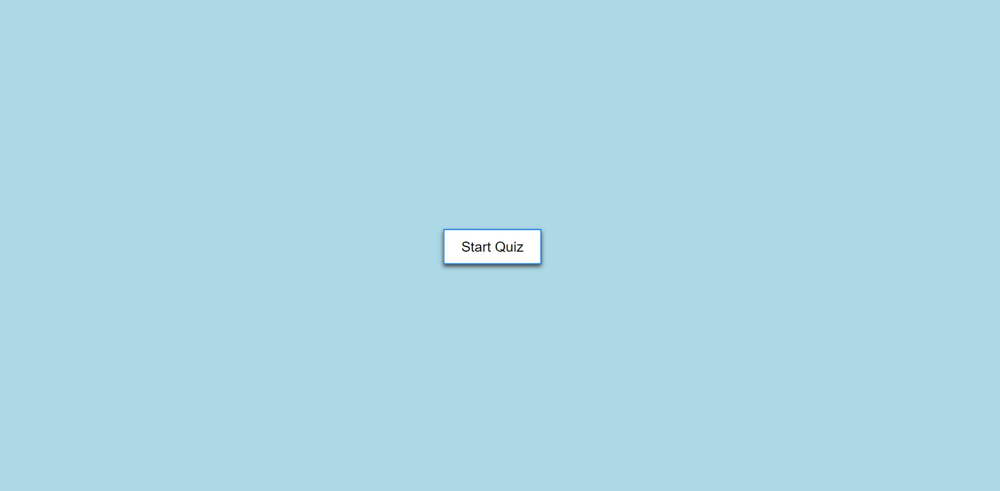
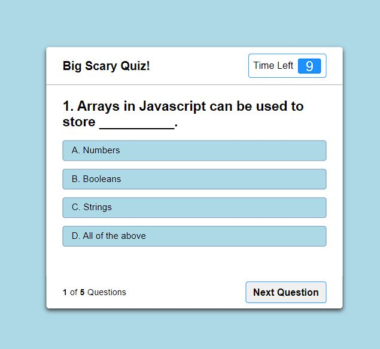

# My-Code-Quiz
 

## Description
This coding quiz allows for a quick practice refresher of basic coding knowledge and terms.

## Usage
Upon opening the page the site will prompt users to agree to the quiz terms:

1. You will have 10 seconds per question.
2. Once selected, you may not change your answer.
3. You can not select any options once the timer runs out.
4. You can not exit while taking the Quiz.
5. You will get points for correct answers.

Once the terms are agreed to, the quiz will start the questions allowing for 10 seconds per answer.

 

## Credits

N/A

## License

Please refer to the LICENSE in the repo.

## Links

Github: https://github.com/Anthonykahly/my-code-quiz
Pages:  https://anthonykahly.github.io/My-Password-Generator/
